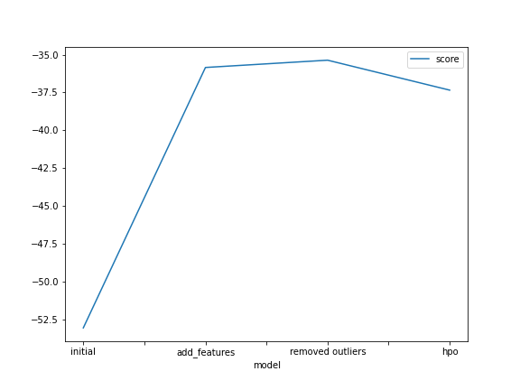
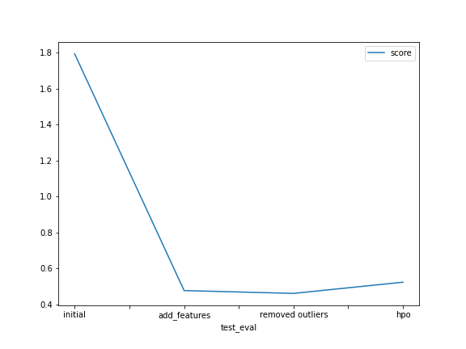

# Report: Predict Bike Sharing Demand with AutoGluon Solution
#### MUHAMMAD SAAD ANSARI

## Initial Training
### What did you realize when you tried to submit your predictions? What changes were needed to the output of the predictor to submit your results?
The model did not performed best because the datetime feature was needed to be split. Hence after adding the features year,month,day and hour and then
I dropped the datetime column. This resulted in improved score and hence better model

### What was the top ranked model that performed?
WeightedEnsemble_L3 performed the best, but talking about individual models, XT was the best

## Exploratory data analysis and feature creation
### What did the exploratory analysis find and how did you add additional features?
I dropped datetime feature and added year,month,day and hour each as a separate feature, also I removed the outliers. I used geekforgeeks as a reference 
for finding and removing outliers

### How much better did your model preform after adding additional features and why do you think that is?
After adding features, the kaggle score improved from 1.79 to 0.47 

## Hyper parameter tuning
### How much better did your model preform after trying different hyper parameters?
I trained the model on 
1) 'GBM': {'num_boost_round': 150, 'num_leaves': ag.space.Int(lower=35, upper=70, default=36), 'num_iterations': 300
2) 'KNN': {'n_neighbors': 10, 'weights': 'distance', 'algorithm': 'auto'}
3) 'RF': {'n_estimators': 200}
Some other options I tried was changing the num_boost_round for gbm, n_neighbours for knn and many others but the above settings gave the best score

### If you were given more time with this dataset, where do you think you would spend more time?
I would have performed additional EDA like data normalization and would have added some new features. Also regarding models, I would have 
tried some other models with hyperparameter tuning and also training a single model at a time

### Create a table with the models you ran, the hyperparameters modified, and the kaggle score.
|model|hpo1|hpo2|hpo3|score|
|--|--|--|--|--|
|initial|default|default|default|1.79307|
|add_features|default|default|default|0.47678|
|removed outliers|default|default|default|0.46102|
|hpo|GBM- num_boost_round: 150, num_leaves: ag.space.Int(lower=35, upper=70, default=36), num_iterations: 300|KNN- n_neighbors: 10, weights: distance, algorithm: auto|RF- n_estimators: 200|0.52332|

### Create a line plot showing the top model score for the three (or more) training runs during the project.

TODO: Replace the image below with your own.

### Create a line plot showing the top kaggle score for the three (or more) prediction submissions during the project.

TODO: Replace the image below with your own.

## Summary
I would summarize project 1 as follows:
1) load data using pandas
2) created an initial model and submitted to kaggle and a score was achieved
3) performed EDA and added additional features
4) submitted the new model to kaggle and the score improved
5) removed outliers from dataset
6) submitted to kaggle and the score futher improved
7) performed hyperparameter tuning with GBM, KNN, RF and submitted to kaggle and score was achieved
8) created the graphs of model score and kaggle score
